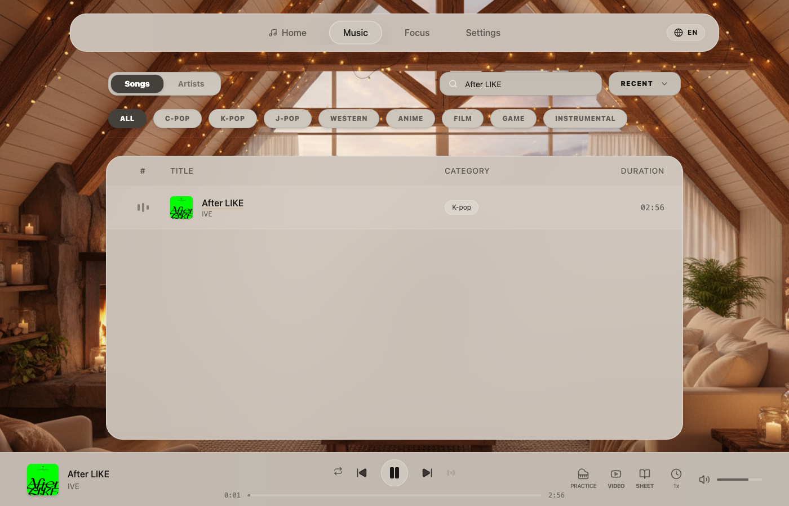

# CIP Music

CIP Music brings piano listening, focused work, and guided practice into one cross-platform music experience.

## Overview

CIP Music is a cross-platform music application for listening, focusing, relaxing, and practicing modern piano arrangements. It combines a curated catalog with artist and track discovery, immersive visual scenes, mixable ambience, a Pomodoro timer, and an interactive Practice Mode for supported songs.

CIP Music is **not an AI music generator**. Codex and GPT-5.6 were used during product development; they are not user-facing runtime features of the application.

## The Problem

Most music products separate activities that naturally belong together:

- Music players make listening largely passive.
- Piano learning resources live outside the player and interrupt the path from hearing a song to practicing it.
- Focus tools provide timers or noise, but rarely offer a coherent musical and visual experience.
- Music creators must publish recordings, scores, practice assets, and catalog metadata through disconnected workflows.

For listeners and learners, that means switching products whenever their intent changes. For creators, it means maintaining the same musical work across several unrelated systems.

## What CIP Music Does

- **Curated piano catalog:** Browse a maintained library across C-pop, K-pop, J-pop, Western pop, anime, film, game, and instrumental categories.
- **Tracks and artists:** Search songs, browse artist collections, open artist detail pages, and follow verified video and sheet-music links when available.
- **Continuous listening:** Play, seek, repeat, move between tracks, and use curated radio-style continuation.
- **Practice Mode:** For supported tracks, render the score alongside synchronized playback and an on-screen keyboard. Practice controls include tempo adjustment, metronome, left/right-hand filtering, MIDI output controls, and measure-based A/B looping.
- **Focus experience:** Combine music with independently controlled ambience layers and run a classic 25/5 or custom Pomodoro session.
- **Immersive scenes and themes:** Change the visual listening scene and switch the interface among light, dark, and system themes.
- **Personal library:** Save favorites and recently played tracks locally as a guest or sync them across devices after signing in.
- **Accounts and membership:** Passwordless email authentication and membership entitlements unlock applicable premium scenes, layered ambience, Practice Mode access, and other premium experiences.
- **Cross-platform delivery:** The web app is live, the iPhone/iPad app is published on the App Store, and an Android application is implemented with native build projects and channel-specific release configuration. A public Android store listing is not linked here because it has not been verified from this repository.

Availability varies by track: Practice Mode, external video, and sheet links appear only where the corresponding resources exist.

## Why It Is Different

CIP Music treats listening, concentration, and piano practice as stages of one experience instead of unrelated utilities. A listener can discover an arrangement, use it as the soundtrack for a focus session, and enter Practice Mode for the same supported track without rebuilding context elsewhere.

Practice Mode is the product's central differentiator. It aligns real audio, MIDI timing, MusicXML notation, keyboard visualization, hand information, tempo changes, and loop boundaries rather than presenting a static score beside a generic player.

The product grew from the working catalog and publishing needs of professional music creators. It has been developed over time, operates with a production catalog and backend, and is publicly available on the web and App Store. This repository is the evolving production web application, not a Build Week-only demo.

## Screenshots or Demo

[Open the live web app](https://cipmusic.com) or view the published [CIP Music App Store listing](https://apps.apple.com/us/app/cip-music/id6767718789).



The repository currently contains only a small set of public web screenshots. A fuller walkthrough video can be added here when a public Build Week demo asset is available.

## Architecture

```text
React/Vite web client
  |-- versioned catalog manifests and catalog overrides
  |-- Supabase Auth, database, and public media storage
  |-- authenticated Netlify Functions
  |     |-- membership and purchase verification
  |     |-- account deletion
  |     `-- short-lived access to private practice/scene assets
  `-- Cloudflare R2 scene delivery

Expo/React Native mobile client (separate repository)
  |-- shared Supabase account, catalog, and entitlement services
  |-- iOS and Android native projects
  `-- EAS plus platform/store-specific purchase and release configuration
```

- **Frontend:** React 19, TypeScript, Vite, Tailwind CSS, Motion, Web Audio APIs, and virtualized catalog lists.
- **Backend and database:** Supabase provides authentication, PostgreSQL-backed product data, user library data, membership records, and media storage.
- **Authentication:** The current web flow uses Supabase passwordless email OTP. Authenticated server operations validate the user's Supabase bearer token.
- **Media delivery:** Public catalog media is delivered through Supabase Storage and configured asset/CDN URLs. Private practice resources and premium scenes are resolved by authenticated brokers that return short-lived signed URLs; premium scene video is stored in Cloudflare R2.
- **Catalog data:** The client loads a versioned JSON manifest, then merges allowed Supabase rows and locked metadata overrides. Import, integrity-audit, localization, ordering, and asset-migration scripts keep that manifest reproducible.
- **Web packaging:** Netlify builds the Vite application into `dist/`, serves the SPA, and deploys the functions in `netlify/functions/`.
- **Mobile packaging:** The companion `cipmusic-mobile` repository uses Expo/React Native and contains complete Xcode and Gradle projects for iOS and Android. Native source is not duplicated in this web repository.

## Tech Stack

| Area | Technologies verified in the repositories |
| --- | --- |
| Web UI | React 19, TypeScript, Vite 6, Tailwind CSS 4, Motion, Lucide React |
| Music and notation | OpenSheetMusicDisplay, `@tonejs/midi`, Tone.js, Web Audio, smplr |
| Data and authentication | Supabase JavaScript client, Supabase Auth, PostgreSQL, Supabase Storage |
| Server and deployment | Netlify, Netlify Functions, Cloudflare R2 via the S3-compatible AWS SDK |
| Membership and payments | Stripe, ZPay, Apple/Google purchase identity or verification paths as applicable by platform |
| Mobile | Expo 54, React Native 0.81, Expo Router, native iOS/Xcode and Android/Gradle projects, EAS Build |
| Quality and operations | TypeScript checks, Playwright dependency, catalog integrity scripts, import verification scripts, and manual cross-platform checklists |

The repository still contains an unused Google GenAI package/configuration remnant from its original scaffold. No application source imports it, CIP Music does not expose a Gemini feature, and a Gemini API key is not required to run the product.

## Built with Codex and GPT-5.6

### Codex

Codex served as the primary engineering collaborator across the production codebase rather than as a runtime dependency. Repository history and development records show work in these areas:

- repository-wide investigation before changes, including catalog, authentication, membership, media, and platform boundaries;
- feature implementation and UI adaptation across the React web client and the separate Expo/React Native iOS and Android client;
- Practice Mode refinement, including MIDI/MusicXML timing, hand inference, responsive layouts, metronome behavior, asset access, and regression cases;
- Supabase authentication, account, cross-device library, membership, schema, and server integration;
- authenticated brokers for private practice assets and signed Cloudflare R2 scene media;
- Stripe, ZPay, Apple account handling, and Google Play server-side purchase verification work;
- mobile release adaptation, native project integration, platform configuration, and store-readiness documentation;
- catalog import pipelines, manifest generation, localization, asset migration, integrity audits, and fail-loud verification tools;
- performance work around long lists, media-heavy backgrounds, rendering, caching, and responsive layouts;
- release-readiness audits, regression checklists, production deployment preparation, and post-change verification.

Codex was instructed to inspect the real repository first, preserve product intent, avoid silent backend or security changes, and make the smallest safe change that met explicit acceptance criteria.

### GPT-5.6

GPT-5.6 supported the higher-level product and engineering reasoning around the work:

- translating the founder's product intent into concrete engineering constraints and acceptance criteria;
- reasoning about UX across listening, focus, practice, membership, and account states;
- developing debugging strategies for timing, authentication, deep links, entitlements, and platform-specific behavior;
- defining cross-platform acceptance criteria without forcing web conventions onto mobile, or vice versa;
- evaluating security, maintainability, performance, release, and product trade-offs;
- refining product copy and the Build Week submission narrative while preserving the product's original purpose.

GPT-5.6 is part of the development process described here. It is not embedded in CIP Music and does not generate music or provide an in-app AI feature.

### Example Development Workflow: Practice Mode

1. The founder identifies a concrete musical or practice problem—for example, a supported song whose score, hand assignment, lead-in, or loop timing does not feel correct.
2. GPT-5.6 turns that intent into constraints: preserve the recorded performance, derive timing from the song's actual MIDI and MusicXML, avoid track-specific magic numbers, and define observable acceptance cases.
3. Codex traces the canonical Practice Mode path across the player, MIDI parser, MusicXML helpers, OSMD renderer, asset broker, and platform-specific UI.
4. Codex implements the smallest safe change and checks TypeScript plus targeted browser, simulator, or physical-device behavior.
5. The founder reviews the musical feel and UX. Findings become explicit regression cases and are iterated without silently redefining the product goal.

This workflow produced repository-visible safeguards such as private practice-asset brokering, timing derived from score/MIDI data, single-track hand inference, responsive practice layouts, and song-specific regression checks backed by general logic.

## Running Locally

### Prerequisites

- Node.js 20.x
- npm

### Install and start the web app

```bash
git clone https://github.com/cipmusicstudios/cipmusic.git
cd cipmusic
npm install
npm run dev
```

Vite serves the development app on `http://localhost:3001`.

For authentication, remote catalog data, favorites sync, membership reads, and protected resources, create `.env.local` with the public browser configuration for a Supabase project:

```dotenv
VITE_SUPABASE_URL=your_supabase_project_url
VITE_SUPABASE_ANON_KEY=your_supabase_anon_key
```

Optional client configuration used by specific deployments includes:

```dotenv
VITE_SONGS_MANIFEST_URL=optional_remote_manifest_url
VITE_SUPABASE_SONGS_BUCKET=optional_public_songs_bucket
VITE_DISTRIBUTION_REGION=global
VITE_READ_MEMBERSHIP_URL=optional_membership_function_url
VITE_ZPAY_CREATE_ORDER_URL=optional_order_function_url
```

Do not put a Supabase service-role key, payment secret, R2 credential, or other server secret in a `VITE_*` variable. Server-only deployment variables are documented by the function implementations and are required only for the corresponding Netlify backend capability.

A Gemini API key is **not required**. The old README instruction requesting `GEMINI_API_KEY` was inherited from the scaffold and did not describe the application.

### Check and build

```bash
npm run lint
npm run build
npm run preview
```

`npm run lint` runs `tsc --noEmit`. The production build also regenerates manifest metadata before Vite creates `dist/`.

Plain `npm run dev` serves Vite only. Netlify Functions such as membership reads and private asset brokers are not emulated by that command, so protected end-to-end flows require an appropriately configured Netlify environment or the deployed application.

## Testing the Project

The fastest evaluation path is the production web app at [cipmusic.com](https://cipmusic.com):

1. Open **Music**, browse categories, search for a track or artist, and start playback.
2. Choose a track whose player shows **Practice**, then open Practice Mode to inspect synchronized notation, keyboard highlighting, tempo, metronome, hand controls, and A/B looping. Practice availability and full access depend on the track and entitlement.
3. Open **Focus**, choose a visual scene, add an ambience layer, and configure the classic or custom Pomodoro timer.
4. Open **Settings** to switch language and light/dark/system theme, and to inspect account, favorites, recently played, and membership states.

Guest browsing is available, but playback is limited and account-backed Focus, synchronization, protected Practice resources, and premium features require the appropriate sign-in or membership state. Review credentials, if supplied to judges, belong in Devpost's private testing instructions—not in this public repository.

For mobile evaluation, use the [CIP Music App Store release](https://apps.apple.com/us/app/cip-music/id6767718789). The Android implementation is maintained in the companion mobile repository; no public Android download URL is asserted here without a verified store listing.

## Repository Notes

- Large audio, video, notation, and practice assets are not all committed to Git. Production media may be served from Supabase Storage, Cloudflare R2, or a configured CDN.
- Private practice assets and premium scene media intentionally require authenticated server brokers and short-lived URLs.
- Local `.env` files, service-role credentials, payment secrets, signing material, and production infrastructure credentials are not provided by the repository.
- The committed manifest allows the catalog UI to load, but complete authentication, membership, protected media, payment, and remote-update behavior depends on configured external services.
- This repository contains the complete web application and its Netlify server functions. Complete iOS and Android native projects live in the separate `cipmusic-mobile` repository.
- Catalog maintenance commands may read or write production-adjacent data. They are not required for ordinary local review and should not be run without the appropriate environment and operational approval.

## Team

- **Founder:** Product direction, UX direction, piano music production, catalog curation, and release decisions.
- **Engineering:** Founder-led development supported by Codex and GPT-5.6 for implementation, investigation, debugging, testing, and release preparation.

## License

All rights reserved unless otherwise stated.
